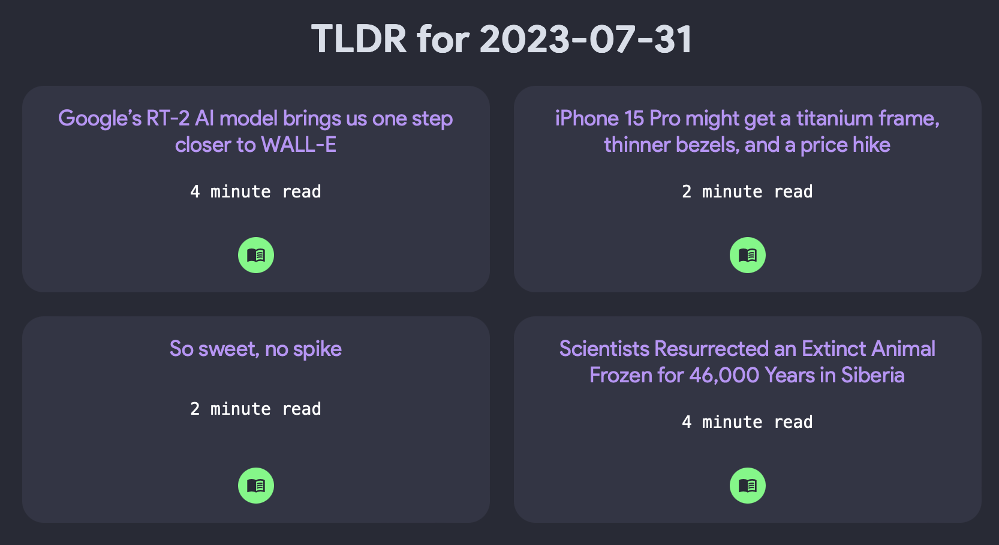

# TLDR Scrapper

This application will let you view articles from the `ai`, `tech` and `webdev` topics from the [TLDR Newsletter](www.tldr.tech) in an easy-to-read web browser format as opposed to a list of links in an e-mail. If you're interested in other TLDR topics you can simply adjust the list of URLs in the `generate_links_html()` function within [app.py](app.py).

No subscription to TLDR is needed to view these links.



You can run this application either locally or via Docker:

### Run Locally
* Download and extract the code in this repository.
* Run the `app.py` Python file
* Navigate to [localhost:5001](localhost:5001)


### Run in Docker
* With Docker installed, pull the image from DockerHub:

    ```docker pull braundo30/tldr-scrapper:latest```

    ```docker run -p 5001:5001 braundo30/tldr-scrapper:latest```

* Navigate to [localhost:5001](localhost:5001)
